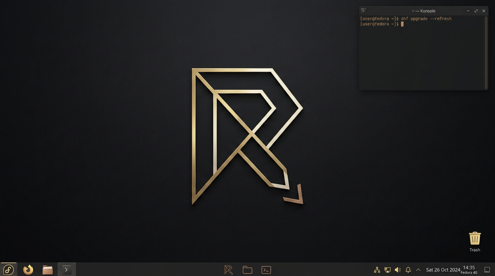

<p align="center">
  
</p>

<h1 align="center">Ryven</h1>

<p align="center">
  Fedora 44 Kinoite desktop — NVIDIA open, Terra multimedia, CachyOS-inspired frame times.
</p>

<p align="center">
  
</p>

| | |
| --- | --- |
| Image | `ghcr.io/mheci/ryven:latest` |
| Base | `ghcr.io/ublue-os/kinoite-main` (Fedora **44** KDE) |
| Login | Plasma Login Manager (`plasmalogin`), not SDDM |
| GPU | ublue `akmods-nvidia-open` + OGC kernel |
| Memory | **zswap on**, **zram off** |
| Default look | `org.ryven.desktop`, Darkly, Breeze icons, Inter Regular, wallpaper **10** |
| ISO | weekly, after the scheduled OCI build, `ghcr.io/mheci/ryven:latest` |

## Switch

```bash
sudo bootc switch ghcr.io/mheci/ryven:latest
sudo bootc upgrade          # stage only — do not pass --apply
```

Weekly CI rebuilds GHCR (Sunday 06:00 UTC). ISO follows a successful scheduled image. Hosts never auto-reboot on updates. greenboot `redboot-auto-reboot` stays enabled.

## Desktop and games

- NVIDIA VA-API: `libva-nvidia-driver` x86_64 + i686 (`NVD_BACKEND=direct`)
- 10 GiB shader caches
- Steam RPM, **proton-cachyos** (SLR), NTSync 0666, Proton Wayland + HDR
- `terra-gamescope`, ScopeBuddy (`scb`), MangoHud, Heroic, ProtonPlus, Helium, GPU Screen Recorder, Polychromatic
- **scx-scheds-nightly** + **scx-tools-nightly** / `scx_loader` with lavd `--performance`
- **bpftune-gaming** and **ananicy-cpp** + CachyOS rules
- beesd@UUID on host btrfs, NVMe kyber / HDD bfq
- **mpv-nightly**, Terra ffmpeg, **t3code-nightly**, zed-nightly, ghostty-tip
- uupd + topgrade (no auto-reboot)
- First-boot Flatpaks on `/var`: Flatseal, Warehouse, Gear Lever, Bazaar

`ujust`: `secure-boot-enroll`, `tpm-luks-unlock`, `scx-select`. Reboot only with `reboot=1`.

## Not in the image

CUDA, Docker/VMs, `terra-release-nvidia`, mesa-freeworld swap, cardwire, v4l2loopback, `curl | sh`.

```bash
just build
just ostree-rechunk
```
